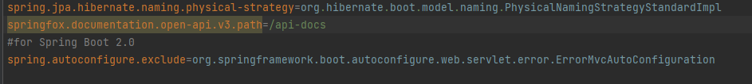
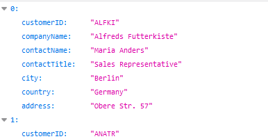
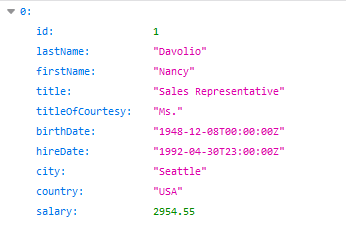
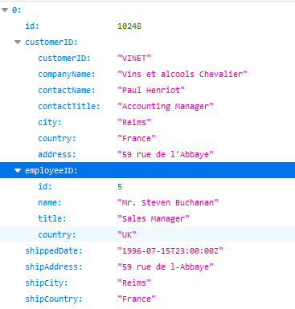
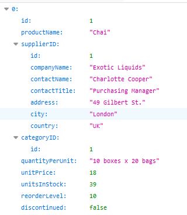
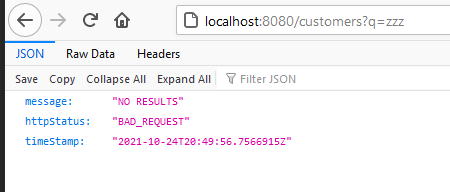
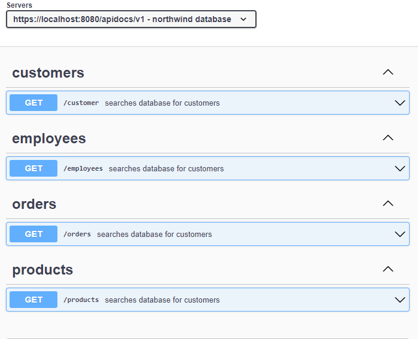
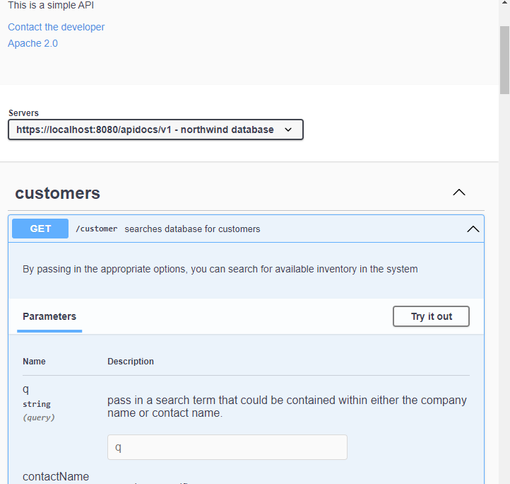

# API for Northwind Project

SpringBoot API for the Northwind Database
## Table of Contents

1. [Instructions](#instructions)
2. [Features](#features)
3. [Testing](#testing)
4. [Problems Faced](#problems)
5. [Future Direction](#future)
6. [License](#license)


## Instructions<a name="instructions"><a/>
1. Pull from git.
2. Add an application properties file, that has your database connection details, as well as the details below.



3. once the database is connected, you will be able to run the application, to view the result of doing so please go to https://localhost:8080 where you will be able to get the various other pages.


4. Clicking on any of the links will take you to the various areas that you can search.
5. There are a number of search parameters in each of the different sections, a good place to start is which the q search term that is the broadest term of searching.
## Features <a name="features"><a/>
### DTOs showing off only useful information
#### Customers



#### Employees



#### Orders
Orders have an even shorter version of the employee dto as to those looking at the orders much less employee information is useful to them.



#### Products 



### Search Functionality
A non-specific search function is included for each section where you can search for a term to see if it is contained within a number of different fields.
More specific search terms can be used to further narrow down options.
It is possible to layer search terms on top of each other to get the exact results you want.

###Error handling
A number of the errors that may occur on use, have been changed so that they display an appropriate message to the user e.g. so that they know that there is no search results for that particular term.



## Testing <a name="testing"><a/>

During various phases of development there has been a number of JUnit tests that have been carried out, here are a couple from various sections of the application.

```java
@Test
public void CustomerLogicTestNull(){

        QCustomerEntity customer = QCustomerEntity.customerEntity;
        BooleanExpression booleanExpression = customer.isNotNull();
        BooleanExpression tempBoolEx = booleanExpression;
        booleanExpression = customerController.customerLogic(booleanExpression,customer,null,null,null,null,null);
        Assertions.assertEquals(tempBoolEx,booleanExpression);
        }

@Test
public void CustomerLogicTestCityNotNull(){
        QCustomerEntity customer = QCustomerEntity.customerEntity;
        BooleanExpression booleanExpression = customer.isNotNull();
        BooleanExpression tempBoolEx = booleanExpression;
        booleanExpression = customerController.customerLogic(booleanExpression,customer,"London",null,null,null,null);
        Assertions.assertNotEquals(tempBoolEx,booleanExpression);
        }
```

## Problems Faced<a name="problems"><a/>

### OpenApi documentation
Unfortunately there were a number of problems getting the openapi documentation to work, so the section that I did create I have included images of here as a proof of concept.




## Future Project Direction <a name="future"><a/>
I would like to make sure that the OpenApi Documentation that I started, is completed and implemented.

## License <a name="license"><a/>
[MIT](https://choosealicense.com/licenses/mit/)

